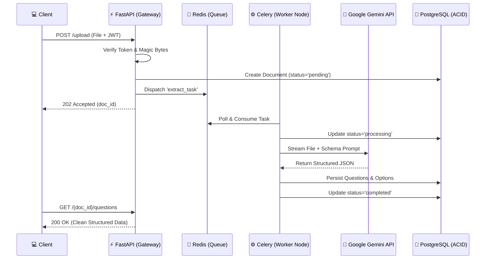

<div align="center">


# Pragati Bharati: Document Intelligence Engine

**Transforming unstructured exam papers into structured knowledge graphs via asynchronous AI pipelines.**

[](https://python.org)
[](https://fastapi.tiangolo.com)
[](https://postgresql.org)
[](https://celeryq.dev)
[](https://ai.google.dev/)
[](https://docker.com)

[**System Architecture**](#-system-architecture) | [**AI Extraction Engine**](#-ai-extraction-engine) | [**API Documentation**](#-api-endpoints) | [**Deployment Guide**](#-deployment-guide)

---
</div>

## 📖 The Vision

Pragati Bharati is an AI-guided education ecosystem designed to move learning beyond the traditional **Test → Score → Rank** model. 

This microservice acts as the foundational data ingestion layer for the ecosystem. It takes chaotic, unstructured, and imperfect real-world documents (low-res scans, multi-page PDFs, rotated mobile photos) and uses advanced multimodal AI to parse them into perfectly structured, system-independent question banks.

---

## 🚀 Key Engineering Highlights

<table>
  <tr>
    <td width="50%">
      <h3>⚙️ Non-Blocking Asynchrony</h3>
      Heavy AI extraction takes time. Instead of keeping HTTP connections hanging, the FastAPI gateway instantly returns a <code>202 Accepted</code>. Background processing is offloaded to <strong>Celery</strong> distributed workers using <strong>Redis</strong> as a message broker.
    </td>
    <td width="50%">
      <h3>🛡️ Zero-Trust Security</h3>
      Security isn't an afterthought. Endpoints are secured via <strong>JWT Bearer Auth</strong>. File uploads bypass standard MIME-type checks and undergo strict <strong>Magic Byte validation</strong> to prevent malicious payload execution.
    </td>
  </tr>
  <tr>
    <td width="50%">
      <h3>🧠 Beyond Standard OCR</h3>
      Tesseract OCR fails on math formulas, rotated images, and nested tables. This system uses <strong>Google Gemini 1.5 Flash Vision</strong> to contextually understand documents, allowing it to piece together questions that are split across multiple pages.
    </td>
    <td width="50%">
      <h3>🚨 Graceful Degradation</h3>
      Not every document is perfect. The AI assigns a strict <strong>Confidence Score (0.0 - 1.0)</strong> to every extraction. Uncertain answers or missing metadata are instantly flagged in a dedicated <code>/warnings</code> endpoint for human review.
    </td>
  </tr>
</table>

---

## 📐 System Architecture

### Distributed Asynchronous Workflow
Below is the sequence of events triggered when a client uploads a 20MB scanned PDF of a question paper.



---

## 🛠️ Deployment Guide

Built for reproducibility, this entire distributed system boots up in seconds via Docker Compose.

### 1. Configuration
```bash
git clone https://github.com/ruthwik-thotapelli/document-intelligence-question-extraction-service.git
cd document-intelligence-question-extraction-service

# Initialize environment variables
cp .env.example .env
```
> **⚠️ Action Required:** Open `.env` and add your `GEMINI_API_KEY`. Without this, the system will fall back to a mock data generator for testing.

### 2. Boot the Infrastructure
```bash
# Start Postgres, Redis, FastAPI, and Celery Workers
docker-compose up --build -d

# Initialize the Database Schema (Alembic)
docker-compose exec web alembic upgrade head
```

### 3. Verify Health
Visit the auto-generated OpenAPI documentation to test the system:
👉 **[http://localhost:8000/docs](http://localhost:8000/docs)**

---

## 📡 API Endpoints Reference

All application endpoints (except authentication) enforce strict JWT validation. Errors are returned adhering strictly to the **RFC 7807 (Problem Details for HTTP APIs)** standard.

<details>
<summary><b>View API Routing Table</b></summary>
<br>

| Endpoint | Method | Purpose |
| :--- | :---: | :--- |
| `/api/v1/auth/register` | `POST` | Provision a new user account. |
| `/api/v1/auth/login` | `POST` | Exchange credentials for a JWT. |
| `/api/v1/documents/upload` | `POST` | Ingest PDF/Img. Returns `doc_id`. |
| `/api/v1/documents/{id}/status` | `GET` | Polling endpoint for Celery task state. |
| `/api/v1/documents/{id}/questions`| `GET` | Retrieve structured question outputs. |
| `/api/v1/documents/{id}/answers` | `GET` | Retrieve answer key data (with confidence mapping). |
| `/api/v1/documents/{id}/warnings` | `GET` | Retrieve questions requiring human review. |

</details>

---

## 🧪 Demonstration & Testing

To validate the core requirements of this assignment, please follow this testing flow:

1. **Load Postman:** Import `postman/collection.json` into your local Postman workspace.
2. **Authenticate:** Run the Registration and Login endpoints. The token is automatically saved to your Postman environment.
3. **Upload Imperfect Data:** Use the `Upload PDF` endpoint to upload `samples/question_paper.pdf`.
4. **Witness Background Processing:** Hit the `Status` endpoint. You will see the state transition asynchronously without blocking your client.
5. **Review AI Logic:** Fetch the extracted questions. Notice how **Question 5** is perfectly merged despite spanning multiple pages in the raw PDF, and how the answer key is automatically mapped from the bottom of the document to the respective questions.

---
<div align="center">
  <p><b>Designed & Engineered for the Pragati Bharati Evaluation</b></p>
</div>
