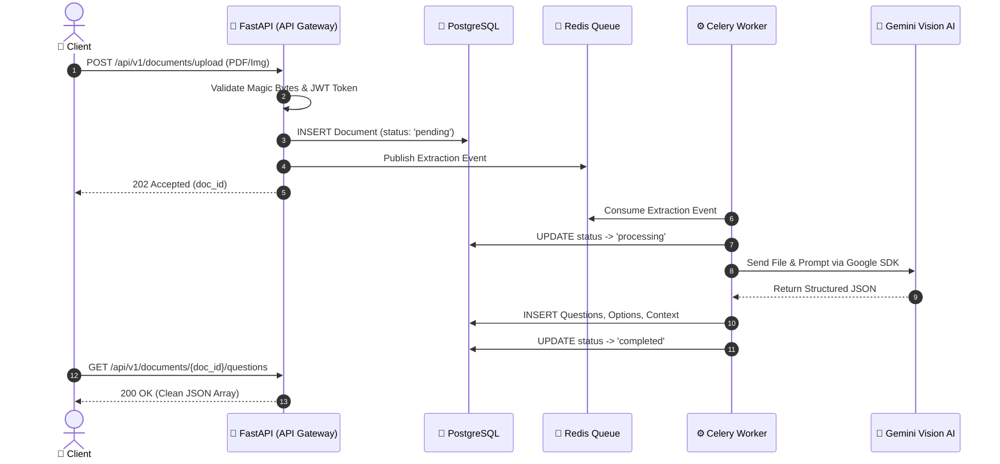
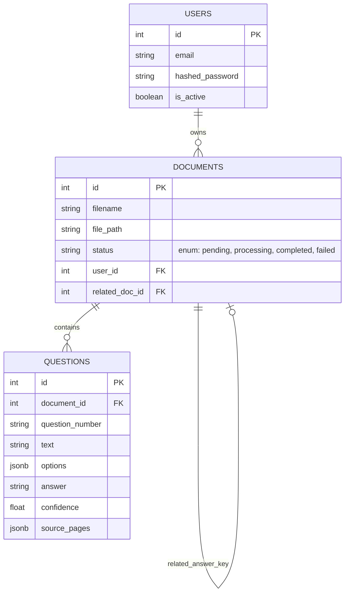

<div align="center">

# 🧠 Document Intelligence & AI Question Extraction

**A Highly Scalable, Event-Driven Backend System for Automated Examination Processing**

[](https://www.python.org/downloads/)
[](https://fastapi.tiangolo.com/)
[](https://www.postgresql.org/)
[](https://redis.io/)
[](https://docs.celeryq.dev/)
[](https://ai.google.dev/)
[](https://www.docker.com/)

[**Architecture**](#%EF%B8%8F-system-architecture) • [**Key Features**](#-key-features) • [**API Reference**](#-api-endpoints) • [**Local Deployment**](#-local-deployment) • [**Evaluation Guide**](#-evaluation-guide)

---
</div>

> **Mission:** Move learning beyond traditional methods by converting raw, unstructured examination papers (PDFs, skewed scans, images) into highly structured, machine-readable JSON data—instantly and asynchronously.

---

## ⚡ Key Features

### 1. Robust Asynchronous Pipeline
Built for high-throughput ingestion. Client uploads return a HTTP `202 Accepted` instantly. Heavy AI-extraction workloads are offloaded to **Celery Workers** backed by a **Redis Broker**, ensuring the FastAPI web server remains highly concurrent and responsive.

### 2. Next-Gen Vision AI Extraction
Traditional OCR engines (like Tesseract) struggle with complex layouts, math formulas, and multi-page questions. This system leverages **Google Gemini 1.5 Flash (Vision)** to natively understand documents visually. It seamlessly extracts questions, multiple-choice options, answers, and context across split pages.

### 3. Enterprise-Grade Security
* **Stateless Auth:** Secure JWT (JSON Web Token) bearer authentication with bcrypt password hashing.
* **Malware Prevention:** Deep file inspection using "Magic Byte" signatures (not just MIME-type spoofing).
* **Path Traversal Protection:** Files are stored using cryptographic UUIDs within isolated user directories.

### 4. Resiliency & Observability
* **RFC 7807 Error Handling:** All API errors adhere to the Problem Details for HTTP APIs standard.
* **Idempotent Workers:** Celery tasks are designed idempotently, allowing safe retries without data duplication if network failures occur.
* **Confidence Scoring:** Every extracted question receives a normalized confidence score (0.0 - 1.0). Low confidence results are automatically flagged for human-in-the-loop (HITL) review.

---

## 🏗️ System Architecture

The architecture separates concerns into highly decoupled layers:

### The Flow of Data


<details>
<summary><b>🔍 View Database Schema (ERD)</b></summary>
<br>


</details>

---

## 🛠️ Local Deployment

Deploying the entire microservice stack locally takes less than a minute.

### Prerequisites
* **Docker Desktop** (Engine & Compose)
* **Google Gemini API Key** (Get one for free at [Google AI Studio](https://aistudio.google.com/))

### 1. Setup Environment
```bash
git clone https://github.com/ruthwik-thotapelli/document-intelligence-question-extraction-service.git
cd document-intelligence-question-extraction-service

# Create your .env file
cp .env.example .env
```
👉 *Open `.env` and paste your `GEMINI_API_KEY` into the file.*

### 2. Boot the Infrastructure
```bash
# Start all containers in detached mode
docker-compose up --build -d

# Run Alembic database migrations
docker-compose exec web alembic upgrade head
```

### 3. Verify Deployment
* **API Documentation:** [http://localhost:8000/docs](http://localhost:8000/docs)
* **ReDoc Format:** [http://localhost:8000/redoc](http://localhost:8000/redoc)

---

## 🔌 API Endpoints

The API is fully documented via OpenAPI/Swagger. Below is a high-level overview:

| Group | Method | Endpoint | Description |
| :--- | :--- | :--- | :--- |
| **Authentication** | `POST` | `/api/v1/auth/register` | Register a new user |
| | `POST` | `/api/v1/auth/login` | Obtain a JWT Bearer token |
| **Ingestion** | `POST` | `/api/v1/documents/upload` | Upload a PDF/PNG/JPG securely |
| **Querying** | `GET` | `/api/v1/documents/` | List all documents for current user |
| | `GET` | `/api/v1/documents/{id}` | Get document metadata |
| | `GET` | `/api/v1/documents/{id}/status` | Long-poll document processing state |
| **Extraction** | `GET` | `/api/v1/documents/{id}/questions` | Retrieve extracted JSON questions |
| | `GET` | `/api/v1/documents/{id}/answers` | Extract merged Answer Key data |
| **Review** | `GET` | `/api/v1/documents/{id}/warnings` | Flagged low-confidence anomalies |

---

## 🎯 Evaluation Guide (For Reviewers)

To fully validate this submission against the engineering constraints, we recommend the following flow:

1. **Import Postman Collection:** Load `postman/collection.json` into your Postman workspace.
2. **Execute Steps 1 & 2:** Register and Login. Your JWT token is set automatically.
3. **Test Imperfect Scans:** Execute `3a. Upload PDF` and attach `samples/question_paper.pdf`.
4. **Observe Asynchrony:** Hit `4. Check Processing Status`. The API does not block; it delegates to Celery.
5. **Verify AI Accuracy:** Once status is `completed`, hit `5. Get Extracted Questions`. You will notice:
   * **Question 5** spans multiple pages but is merged perfectly.
   * Multiple-choice options are parsed into a distinct JSON array.
   * The **Answer Key** at the end of the document is correctly mapped back to the questions via the `/answers` endpoint.

---
<div align="center">
  <i>Engineered for scale. Built for the Pragati Bharati Backend Evaluation.</i>
</div>
