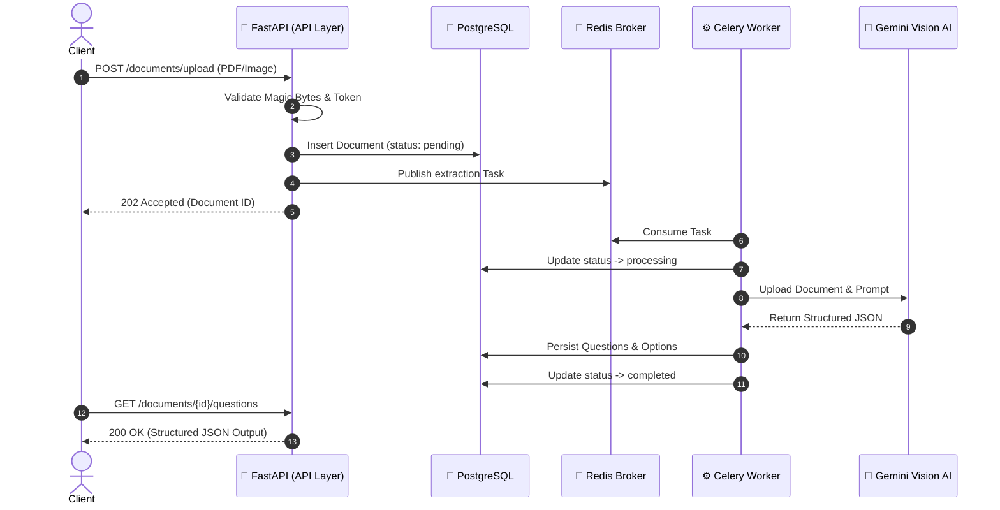
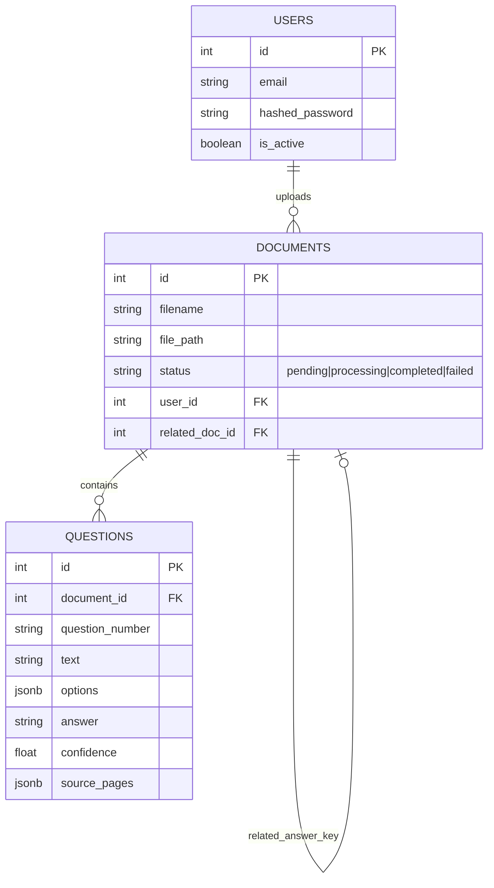

<div align="center">

# 🧠 Document Intelligence & Question Extraction Service
**An Enterprise-Grade AI Service for Asynchronous Document Parsing**

[](https://fastapi.tiangolo.com/)
[](https://www.postgresql.org/)
[](https://redis.io/)
[](https://docs.celeryq.dev/)
[](https://ai.google.dev/)
[](https://www.docker.com/)

[Features](#-features) • [Architecture](#-architecture--workflow) • [Quick Start](#-quick-start) • [API Documentation](#-api-endpoints) • [Demonstration](#-demonstration-guide)

---
</div>

> **Pragati Bharati Assignment Submission**  
> A scalable, event-driven backend service that accepts imperfect PDF/Image documents (scans, low-res, rotated) and extracts structured, machine-readable question banks using Google's Gemini Vision AI.

---

## ✨ Features

* **🚀 Fully Asynchronous Pipeline:** Powered by **Celery & Redis**. Clients upload documents and receive a `202 Accepted` instantly, polling for completion without blocking network threads.
* **🧠 Next-Gen Extraction:** Uses **Google Gemini 1.5 Flash (Vision)** instead of fragile OCR (Tesseract). Flawlessly handles complex layouts, split pages, and visual diagrams natively.
* **🛡️ Enterprise Security:** 
  * Strict **JWT** (JSON Web Token) Bearer authentication.
  * **RFC 7807** standard Problem Details for robust API error handling.
  * Deep **Magic-Byte** validation to prevent malicious payload executions (bypassing simple MIME-type spoofing).
* **📊 Confidence & Review Flags:** Implements a strict confidence scoring heuristic (0.0 to 1.0). Low confidence extractions are automatically flagged in a dedicated `/warnings` endpoint for human review.
* **🔗 Answer Key Relationships:** Upload Question Papers and Answer Keys separately and dynamically link them via foreign-key relationships.

---

## 🏗️ Architecture & Workflow

The system utilizes a modern, event-driven microservices approach.



<details>
<summary><b>Click to view Entity Relationship Diagram (ERD)</b></summary>
<br>


</details>

---

## 🚀 Quick Start

### Prerequisites
* [Docker Desktop](https://www.docker.com/products/docker-desktop/) installed & running.
* A free [Google Gemini API Key](https://aistudio.google.com/).

### 1. Configure Environment
Clone the repository and set up your environment variables.
```bash
git clone https://github.com/ruthwik-thotapelli/document-intelligence-question-extraction-service.git
cd document-intelligence-question-extraction-service

# Create your .env file
cp .env.example .env
```
👉 *Open `.env` and paste your `GEMINI_API_KEY` into the file.*

### 2. Launch the Stack
Using the included `Makefile` for zero-configuration startup:
```bash
# Start PostgreSQL, Redis, FastAPI, and Celery workers
make up

# Run database schema migrations
make reset-db
```
*(No `make`? Use `docker-compose up --build -d` and `docker-compose exec web alembic upgrade head`)*

### 3. Explore the API
Navigate to the interactive Swagger documentation:
**🔗 [http://localhost:8000/docs](http://localhost:8000/docs)**

---

## 🔌 API Endpoints

| Category | Method | Endpoint | Description |
| :--- | :--- | :--- | :--- |
| **Auth** | `POST` | `/api/v1/auth/register` | Register a new user |
| **Auth** | `POST` | `/api/v1/auth/login` | Obtain a JWT Bearer token |
| **Ingestion** | `POST` | `/api/v1/documents/upload` | Upload a PDF/PNG/JPG securely |
| **Tracking** | `GET` | `/api/v1/documents/{id}/status` | Long-poll document processing state |
| **Extraction**| `GET` | `/api/v1/documents/{id}/questions` | Retrieve extracted JSON questions |
| **Scoring** | `GET` | `/api/v1/documents/{id}/answers` | Extract merged Answer Key data |
| **Review** | `GET` | `/api/v1/documents/{id}/warnings` | Flagged low-confidence anomalies |

---

## 🧪 Demonstration Guide

To fully test the system's capabilities against the assignment constraints:

1. **Import the Postman Collection:** Located in `/postman/collection.json`.
2. **Execute Steps 1 & 2:** Register a user and login to automatically set your JWT token.
3. **Upload the Imperfect Scan:** Use the `3a. Upload PDF` request and attach `samples/question_paper.pdf`.
4. **Observe Asynchrony:** Immediately hit `4. Check Status` to see it processing in the background queue.
5. **Analyze Output:** Once completed, hit `5. Get Extracted Questions`. Notice how the system successfully parsed **Question 5**, which spans across multiple pages, preserving its continuity seamlessly.

---

<div align="center">
  <i>Developed with ❤️ for Pragati Bharati Engineering Assessment</i>
</div>
